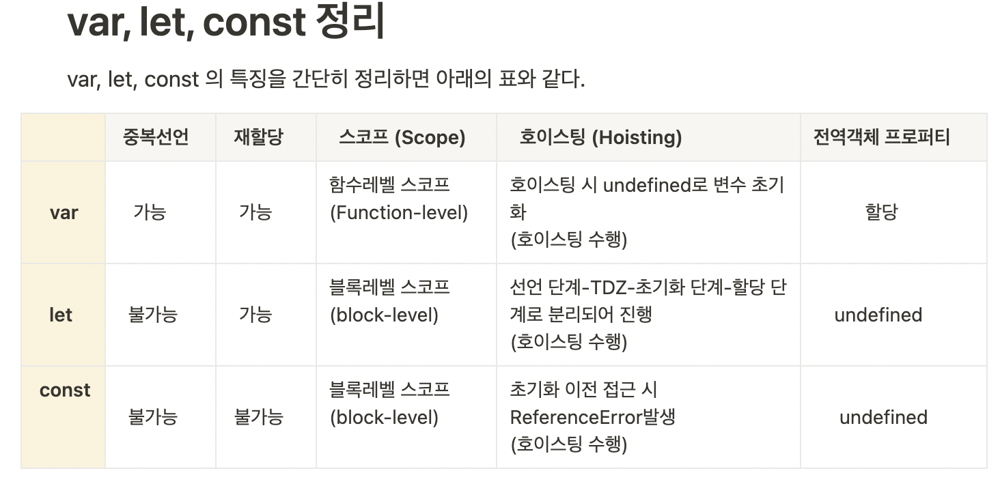
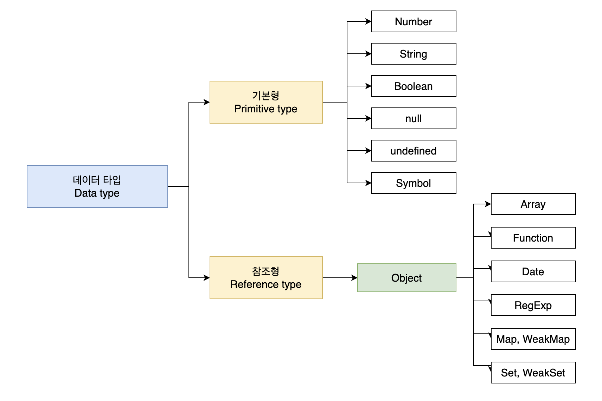

# 04. 변수

## 메모리 memory

- 메모리 셀
- 2진수 저장
- 메모리 주소
    - 주소에 직접 접근하는건 위험
    - 핵심 메모리주소를 건들면 치명적 오류
    - js는 직접적인 메모리 제어 허용 안함
        - 상황에 따라 임의로 결정
    - c언어는 직접 접근?
        - 포인터

## 변수 variable

- 변수는 하나의 값을 저장하기 위해 확보한 메모리 공간 자체 또는 그 메모리 공간을 식별하기 위해 붙인 이름
- 값을 저장하고 참조하는 메커니즘
- 값을 가르키는 상징적인 이름

할당 assignment: 변수에 값을 저장

참조 referene: 변수에 저장된 값을 불러들인다.

식별자: identifier: 어떤 값을 구별해서 식별할 수 있는 고유한 이름 *값이 아니라 메모리 주소를 기억

## 변수 선언 variable declaration

- 값을 저장하기 위한 메모리 공간을 확보하는 것 allocate
- 변수 선언 키워드 var, let const
- 변수 선언만 하고 값을 할당하지 않아도 된다.(undefined라는 값이 암묵적으로 초기화)
- 변수 이름은 실행 컨텍스트에 등록된다.
    - 실행 컨텍스트: 소스코드를 평가하고 실행하기 위해 필요한 환경을 제공하고 실행결과를 실제로 관리하는 영역
- 선언하지 않은 식별자에 접근하면 ReferenceError(참조 에러)발생. 변수에 저장된 주소를 불러오지 못한다.

- js에서 변수선언 시점은 소스코드 평가 과정에서 모든 선언문(변수, 함수 선언문)을 찾아내 먼저 실행한다.
    - 이 과정이 끝나면 모든 선언문을 제외하고 소스코드를 한 줄씩 순차적으로 실행한다. (런타임)
    - 변수 호이스팅: 변수 선언문이 코드의 선두로 끌어 올려진 것처럼 동작하는 특징. 모든 식별자(변수,함수,클래스 등)은 호이스팅된다. 모든 선언문은 런타임 이전에 먼저 실행되기 때문이다.

- var: 선언된 변수는 몇번이고 재선언 가능 재할당 가능, 호이스팅 시 undefined로 초기화
- let: 재선언 불가능 재할당 가능
- const: 재선언 재할당 불가능

# 05. 표현식과 문

- 값value: 식(표현식expression)이 평가evaluate되어 생성된 결과. 평가란 식을 해석해서 값을 생성하거나 참조하는 것을 의미한다.
- 리터럴literal: 사람이 이해할 수 있는 문자 또는 약속된 기호를 사용해 값을 생성하는 표기법notation. 리터럴 자체는 표현식이다.
- 표현식expression: 값으로 평가될 수 있는 문. 표현식이 평가되면 새로운 값을 생성하거나 기존값을 참조한다.

# 06. 데이터 타입

데이터 타입: 값의 종류

심벌 symbol: 변경 불가능한 원시 타입의 값. 다른 값과 중복되지 않는 유일값

데이터 타입이 필요한 이유

- 값을 저장할 때 확보해야 하는 메모리 공간의 크기를 결정하기 위해
- 값을 참조할 때 한 번 읽어 들여야 할 메모리 공간의 크기를 결정하기 위해
- 메모리에서 읽어들인 2진수를 어떻게 해석할지 결정하기 위해

정적 타입과 동적 타입

- c, java는 정적 언어. 변수를 선언할 때 데이터 타입을 선언한다. 명시적 타입 선언
- js, 파이썬, php, 루비, 리스프, 펄 등은 동적 언어. 변수에 값을 할당할 때 데이터 타입이 결정된다.(타입 추론)
그리고 재할당시 변수 타입은 언제든지 변경된다.

# 07. 연산자

- 타입은 강제로 변환된 수 있다. 암묵적 타입 변환, 타입 강제 변환
    - 1 + true(1) // 2
    - 1 + ‘a’ // ‘1a'

- NaN은 자신과 일치하지 않는 유일한 값이다.
    - NaN이 숫자인지 아닌지 알기 위해선 Number.isNaN()을 사용한다.
    - Nam === Nam; // false

- 삼항 연산자 표현식은 값으로 평가할 수 있는 표현식인 문이다.

- typeof 연산자
    - typeof null // object js의 첫번째 버전의 버그이나 고치지 못하고 있다.
    - typeof function // function
    - typeof Symbol() // symbol

- 지수 연산자
    - 2 ** 2 // 4
    - 2 ** 0 // 1
    - 2 ** -2 // 0.25
    - 이전에는 Math.pow를 사용했다.
        - Math.pow(2,2)
    

# 08. 제어문

- 블록문: 코드블록 또는 불록. 0개 이상의 문을 중괄호로 묶은 것 {}
    - 단독으로 사용하거나 제어문이나 함수선언문에 사용한다. if(){}
- 조건문 if와 switch문
    - 조건문에서 조건식은 불리언 값으로 평가된다. 논리적 참, 거짓으로 실행할 코드블록을 결정한다.
    - switch문은 다양한 상황(case)에 따라 실행할 코드블록을 결정할 때 사용한다.
        - 폴스루 fall through: csse문의 마지막에 break를 지정하지 않으면 가장 마지막 case문이나 default문을 실행하는 경우
        - case문 마지막에 break;를 입력해야 한다.
        

# 09 타입 변환과 단축 평가

- 명시적 타입 변환, 타입 캐스팅
    - 값의 타입을 의도적으로 변경하는 것
    - .toString(), String(), Number(), parseInt(), parseFloat()
- 암묵적 타입 변환, 타입 강제 변환
    - 문의 표현식을 평가하는 도중에 암묵적으로 타입이 자동 변환되는 것
    - var x = 10; // 선언시 undefined인 x에 10이 들어가 타입이 number가 되었다.
    - 1 / ‘one’ // NaN
- 논리 연산자를 사용한 단축 평가
    - ‘cat’ && ‘dog’ // ‘dog’ 논리곱 좌항 true, 우항 true이고 논리연산의 결과를 결정하는 두 번째 피연산자 ‘dog’를 반환한다.
    - ‘cat’ || ‘dog’ // ‘cat’ 좌항 우항 둘 다 true이다. 둘 중 하나가 true일 경우 연산결과를 결정하므로 첫번째 true인 ‘cat’을 반환한다.